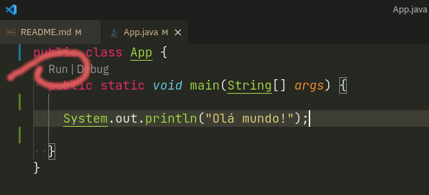
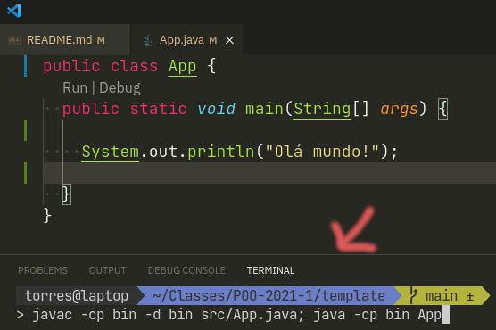

# Template para os projetos Java usando o Visual Studio Code

Um _template_ é um projeto modelo para não iniciar do zero e ter pelo menos uma estrutura básica onde se apoiar.

Antes de começar a desenvolver com este _template_ é necessário ter instalado o Java Software Development Kit (JDK), o editor Visual Studio Code (VSCode) e o utilitário de controle de versão de código _Git_.

## Instalação e Configuração do JDK

É necessário instalar o JDK a partir da versão 8, porém é recomendada versão 11-LTS (Long Term Support - suporte de longo prazo).

Para o Sistema Operacional (SO) Windows, ele pode ser obtido aqui <https://adoptium.net/?variant=openjdk11&jvmVariant=hotspot>. Siga as instruções de instalação e não esqueça de selecionar os opcionais durante o processo, especialmente a parte ⚠️ _"add Java to PATH"_.

Para Sistemas Operacionais Linux/Debian, como Ubuntu, Pop OS, Mint, Elementary, etc, execute no terminal o comando `sudo apt install openjdk-11-jdk`, que a mágica vai acontecer.

Para testar a instalação, seja no Windows ou Linux, abra o _Prompt_ de Comando (cmd) ou o Terminal e execute o compilador Java com `javac -version`. A saída deve ser algo com `javac 11.0.9.1`, ou outra versão.

## Instalação e Configuração do Visual Studio Code (VSCode)

O VSCode pode ser obtido aqui: <https://code.visualstudio.com/download>. A instalação é semelhante nos Sistemas Operacionais Windows e Linux.

No Windows, abra o instalador e não esqueça de selecionar todos os opcionais, como _adicionar code ao path_ e _adicionar "abrir com code" ao menu_, por exemplo.

No Linux, abra o arquivo `.deb` baixado no gerenciador de pacotes e instale normalmente conforme instruções de seu sistema operacional.

Este _template_ possui uma pasta [.vscode](.vscode) com as extensões necessárias em [extensions.json](.vscode/extensions.json) e as configurações recomendadas em [settings.json](.vscode/settings.json) para um **ambiente de ensino** (config didática). Fique a vontade para alterá-los como achar melhor.

A única extensão obrigatória é a _"vscjava.vscode-java-pack"_.

A extensão _"EditorConfig"_ é bastante recomendada. Ela funciona junto com o arquivo [.editorconfig](.editorconfig) presente neste _template_ para padronizar a formatação dos códigos-fonte.

Finalmente, se preferes o editor em Português, instale a extensão _Portuguese (Brazil) Language Pack for Visual Studio Code_.

## Instalação e Configuração do Git

O Git para Windows pode ser obtido neste link: <https://git-scm.com/download/win>. A instalação é simples e intuitiva. Como sempre, não esqueça dos opcionais, principalmente a opção _adicionar o git ao path_!

Para Linux, o comando `sudo apt install git` no terminal faz tudo.

Para verificar a instalação abra o _prompt_ ou um terminal e execute `git --version`. Se não acusou _"comando não encontrado"_ é porque está tudo funcionando perfeitamente.

## Executando

Com tudo isto pronto deve ser possível abrir o arquivo [App.java](src/App.java) e clicar em `run` para executar o projeto, conforme imagem a seguir:

Se quiser compilar e executar manualmente, abra um prompt/terminal, pode ser o terminal embutido do VSCode, e na pasta raiz do projeto execute os comandos `javac -cp bin -d bin src/App.java; java -cp bin App`, conforme imagem a seguir:

## Licenciamento

Este _template_ é _open source_ licenciado sob a GPL, assim como todos os projetos derivados dele. Mais detalhes em [LICENÇA.md](LICENÇA.md).
